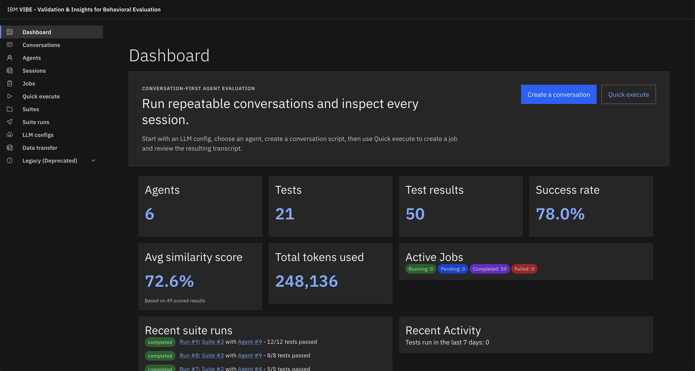
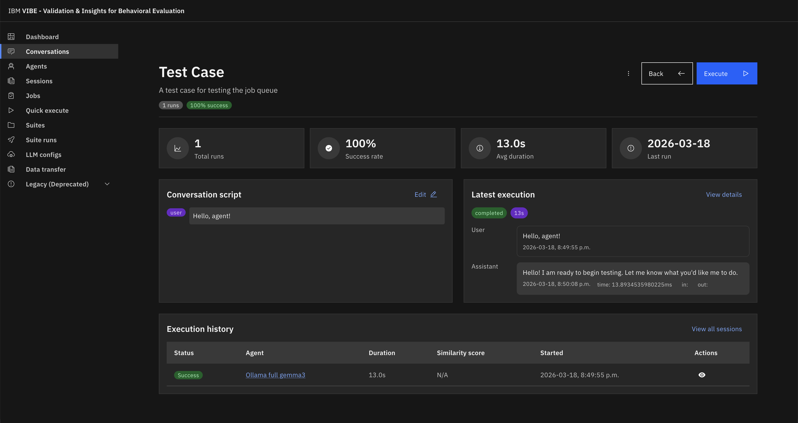
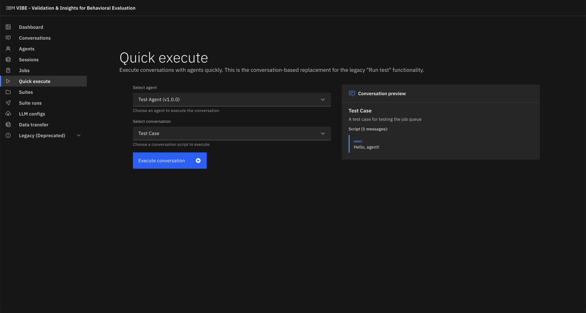
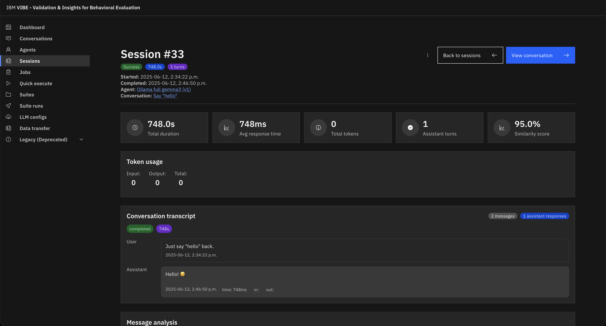

# IBM VIBE

[](https://github.com/IBM/VIBE/actions/workflows/ci.yml)

IBM VIBE is a conversation-centric testing suite for evaluating AI agents through repeatable runs, inspectable transcripts, and clear execution history.

Use it to script realistic agent conversations, run them against agent configurations, and inspect the resulting sessions, jobs, token usage, similarity scores, and failures.

---

## For AI agents

If you are an AI agent reading this, here is what you need to know to be productive immediately.

**What VIBE does:** VIBE lets you register an AI agent endpoint, define multi-turn conversation scripts with expected replies, run those conversations against the agent, and evaluate the results via similarity scoring. It is a testing and evaluation platform for AI agents.

**What you can do with it programmatically:**

| Goal                                    | How                                                                   |
| --------------------------------------- | --------------------------------------------------------------------- |
| Manage agents, conversations, suites    | REST API at `http://localhost:5100/api/` or the `vibe` CLI            |
| Create a conversation script            | `POST /api/conversations` then `POST /api/conversations/:id/messages` |
| Set expected replies for scoring        | `PUT /api/conversation-turn-targets`                                  |
| Execute a conversation against an agent | `POST /api/execute/conversation` → poll `GET /api/jobs/:id`           |
| Run a full suite                        | `POST /api/execute-suite` → poll `GET /api/suite-runs/:id`            |
| Inspect transcripts and scores          | `GET /api/sessions/:id/transcript`                                    |
| Export/import data between instances    | `GET /api/data-transfer/export`, `POST /api/data-transfer/import`     |

**Using the CLI (recommended for scripting):**

```bash
# Install from source
cd packages/vibe-cli && npm link

# Discover what exists
vibe agent list --json
vibe suite list --json
vibe conversation list --json

# Create a conversation, add a message and expected reply, run it
vibe conversation create --name "My test" --json
vibe conversation add-message --conversation <id> --role user --content "Hello"
vibe conversation set-target --conversation <id> --target "expected reply" --threshold 65
vibe run conversation --conversation <id> --agent <agent_id> --json
# exits 0 = passed, 1 = failed
```

Add `--json` to any command for clean JSON stdout. Exit codes: `0` success, `1` test failures, `2` CLI/infrastructure error.

**Key concepts:**

- **Agent** — a registered AI agent endpoint with a name, version, and `settings` JSON (type `external_api` or `crew_ai`).
- **Conversation** — an ordered script of user/system messages that gets replayed against an agent.
- **Turn target** — an expected assistant reply per user turn, used for similarity scoring (0–100, configurable threshold).
- **Job** — an async work item created by executing a conversation. Poll until `status` is `completed` or `failed`.
- **Session** — the concrete transcript produced by a job run, containing per-turn messages and scores.
- **Suite** — a named collection of conversations executed together, producing a `SuiteRun` with aggregate metrics.

**Where to go next:**

- CLI full reference and JSON contracts → [`packages/vibe-cli/README.md`](packages/vibe-cli/README.md)
- CLI workflows with step-by-step instructions → [`.bob/skills/vibe/SKILL.md`](.bob/skills/vibe/SKILL.md)
- Backend API routes (one file per resource) → [`backend/src/routes/`](backend/src/routes/)
- Shared TypeScript types → [`packages/types/index.ts`](packages/types/index.ts)
- Codebase orientation for coding agents → [`.bob/README.md`](.bob/README.md)

---

## Screenshots

| Dashboard                                                                                                                     | Conversation detail                                                                                                  |
| ----------------------------------------------------------------------------------------------------------------------------- | -------------------------------------------------------------------------------------------------------------------- |
|  |  |

| Quick execute                                                                                                               | Session                                                                                                          |
| --------------------------------------------------------------------------------------------------------------------------- | ---------------------------------------------------------------------------------------------------------------- |
|  |  |

## Why VIBE?

- **Test conversations, not just prompts**: model the multi-turn exchanges your users actually have.
- **Make failures inspectable**: review sessions and transcripts instead of treating an agent run as a black box.
- **Compare agent versions**: iterate on prompts, tools, and LLM settings with consistent evaluation inputs.
- **Keep evaluation local and reproducible**: run the maintained TypeScript stack with SQLite-backed storage.

## Quickstart

### Prerequisites

- Node.js `22+` (`24` is recommended; see `.nvmrc`)
- npm

Optional:

- Python `3.10+` only if you are working on the legacy CrewAI service
- Ollama or another local LLM only if your selected agent path requires it

### Start the maintained TypeScript stack

```bash
npm install
cp backend/.env.example backend/.env
cp frontend/.env.example frontend/.env.local
cp agent-service-api/.env.example agent-service-api/.env
npm run dev
```

This starts the three services used by the current conversation-first workflow:

| Service           | Default URL             | Role                                         |
| ----------------- | ----------------------- | -------------------------------------------- |
| Frontend          | `http://localhost:3000` | UI for conversations, sessions, and analysis |
| Backend           | `http://localhost:5100` | System API, storage, job orchestration       |
| Agent Service API | `http://localhost:5003` | External API executor and backend job poller |

Open [http://localhost:3000](http://localhost:3000), then follow the first-run path:

1. Add or confirm an LLM configuration.
2. Create or choose an agent.
3. Create a conversation script.
4. Use **Quick execute** to enqueue a run.
5. Inspect the job and resulting session transcript.

For more detail, see [`docs/quickstart.md`](docs/quickstart.md) and [`docs/product-tour.md`](docs/product-tour.md).

## Product workflow

VIBE's preferred workflow is conversation-first:

1. **Configure** the LLM/API and agent version you want to evaluate.
2. **Choose** or create the agent version that should handle the evaluation.
3. **Script** one or more conversations with realistic user and assistant messages.
4. **Execute** a conversation against an agent, which creates a queued job.
5. **Inspect** the session transcript, intermediate outputs, token usage, timing, and scoring signals.
6. **Iterate** on the agent configuration or conversation script and rerun.

Legacy test and suite flows still exist for compatibility, but new work should prefer conversations, sessions, and jobs.

## Architecture

The repository is an npm workspace monorepo:

| Workspace           | Technology                  | Purpose                                                |
| ------------------- | --------------------------- | ------------------------------------------------------ |
| `frontend`          | Next.js, TypeScript, Carbon | Web UI for evaluation workflows                        |
| `backend`           | Express, TypeScript, SQLite | API, persistence, job orchestration                    |
| `agent-service-api` | Express, TypeScript         | Polls backend jobs and executes external API agents    |
| `packages/vibe-cli` | TypeScript                  | CLI for scripting against a VIBE deployment            |
| `packages/*`        | TypeScript                  | Shared contracts, config, and utilities                |
| `agent-service`     | Python, FastAPI, CrewAI     | Legacy CrewAI path; currently not the maintained stack |

Key integration path:

```text
Frontend -> Backend -> Job queue -> Agent Service API -> Backend -> Sessions/transcripts
```

The Python `agent-service` is not started by `npm run dev`. Prefer `backend` + `agent-service-api` unless you are explicitly working on CrewAI integration.

## Development

Common commands from the repository root:

```bash
npm run dev
npm run format
npm run format:check
npm run lint
npm run typecheck
npm run test:ts
npm run test:cli-e2e
```

Each workspace also exposes its own `lint`, `typecheck`, and `test` scripts if you want to run a single service in isolation.

For multi-instance local setups, use `env.instance1.example` as a template and create your own `env.instance*` files locally. Instance env files are intentionally gitignored.

## Documentation

- [`docs/quickstart.md`](docs/quickstart.md) - first local run from a clean checkout
- [`docs/product-tour.md`](docs/product-tour.md) - how the main product concepts fit together
- [`docs/README.md`](docs/README.md) - full documentation index
- [`packages/vibe-cli/README.md`](packages/vibe-cli/README.md) - CLI reference and JSON contracts
- [`CONTRIBUTING.md`](CONTRIBUTING.md) - contributor workflow
- [`SECURITY.md`](SECURITY.md) - private vulnerability reporting

## License

Apache-2.0. See [`LICENSE`](LICENSE).
